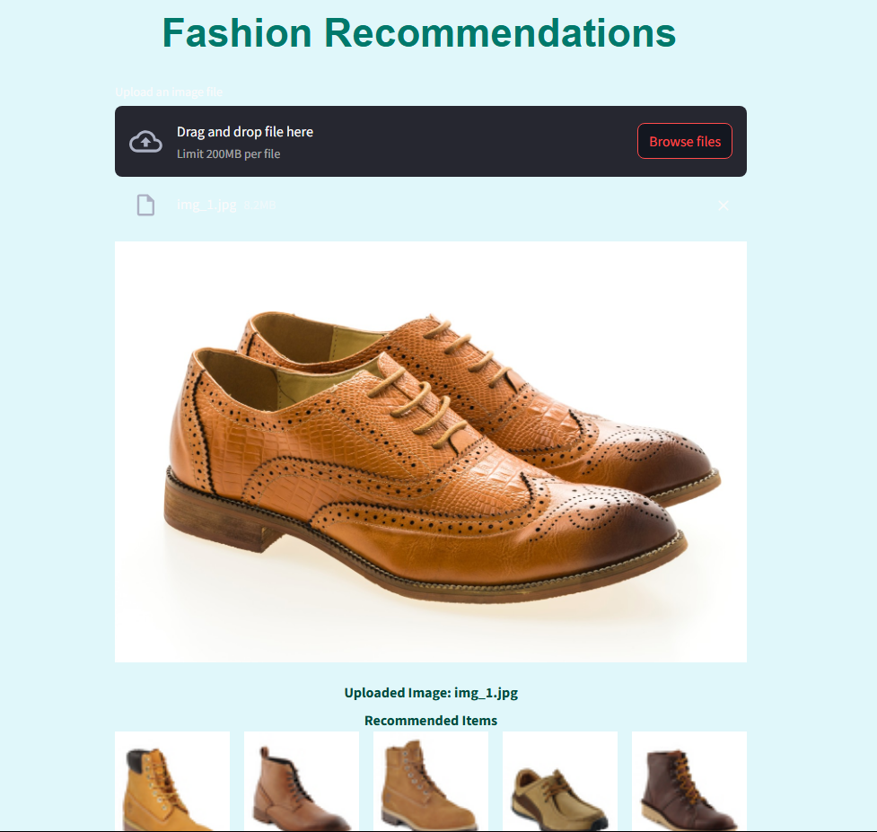

# Fashion Recommendation 

## Find Fashion Items Similar to Your Uploaded Images

### Usage

1. **Download Dataset**:
   - Place your fashion dataset in the project folder. Ensure that it contains the necessary images and their respective metadata.
   - Dataset downloaded is from kaggle fashion-product-image-dataset

2. **Install Required Libraries**:
   - Install the required libraries/modules by running:
     ```bash
     pip install -r requirements.txt
     ```

3. **Model Training and Recommendation**:
   - The `main.py` file contains the code for training the model. Ensure to run this file to prepare the recommendation model.
   - For model purpose ResNet is used.
   - Run the `main.py` file to generate the necessary pickle files. This will create two fundamental files: `feature_list.pkl` and `embeddings.pkl`, which are essential for the model's functionality.
   - You can run it using:
     ```bash
     python main.py
     ```

4. **Get Recommendations for a Specific Image**:
   - The `test.py` file is used to get recommendations for a specific uploaded image. Run this file to test the recommendation system.
   - You can run it using:
     ```bash
     python test.py
     ```

5. **Launch Streamlit Web App**:
   - Finally, run the following command to launch the Streamlit web application:
     ```bash
     streamlit run main.py
     ```

   - Your website will be launched locally, allowing you to upload images and receive fashion recommendations. The recommendations will display similar fashion items based on the uploaded image.

### Example of Recommended Images
After following the steps above, your web application will show images similar to the one you uploaded. Here’s how the recommendations will appear in the web interface:



